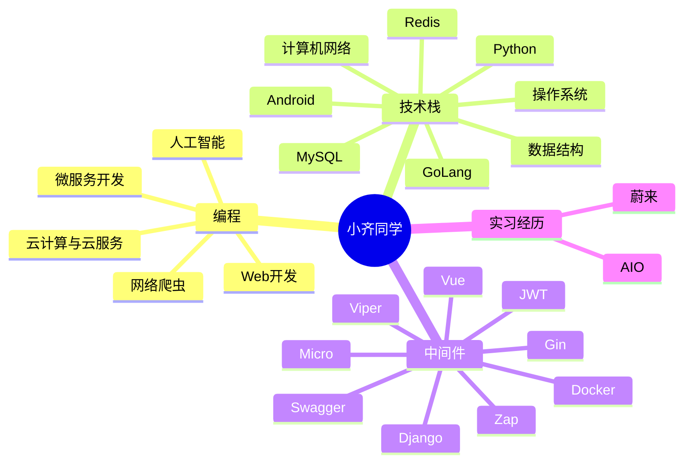

  
  <!-- dynamic typing effect 动态打字效果 -->
  

    
  

  <!-- knock code pictures 敲代码的图片 -->
   

  <!-- profile logo 个人资料徽标 -->
  

    &emsp;
    &emsp;
    &emsp;
    <!-- visitor statistics logo 访客数统计徽标 -->
    
  

  <!-- Snake Code Contribution Map 贪吃蛇代码贡献图 -->
<picture>
  <source media="(prefers-color-scheme: dark)" srcset="https://cdn.jsdelivr.net/gh/qilide/qilide/profile-snake-contrib/github-contribution-grid-snake-dark.svg" />
  <source media="(prefers-color-scheme: light)" srcset="https://cdn.jsdelivr.net/gh/qilide/qilide/profile-snake-contrib/github-contribution-grid-snake.svg" />
  
</picture>

#  🙋 Hello

<table>
<tr><td>

<!-- About me 关于我 -->
### 🤺 About Me

&emsp;&emsp;大家好，我是小齐同学。

&emsp;&emsp;热爱编程、摄影、读书、旅行。

&emsp;&emsp;热爱计算机科学和IT互联网事业，励志成为一名优秀的独立开发者。

&emsp;&emsp;我们正在让这个世界变得更加美好，通过代码的重复使用和延展构建完美体系。

<strong>&emsp;&emsp;We're making the world a better place. Through constructing elegant hierarchies for maximum code reuse and extensibility.</strong>

</td></tr>

<tr>
<td>
  
### 🏢 Work Experience

- [蔚来移动科技有限公司](https://www.nio.cn/) &emsp; 📌 2023-05 —— Now
  
  - 工作岗位：蔚来手机业务-后端开发
  - 工作内容：参与开发蔚来手机系统测试APP

- [艾欧奇迹科技有限公司]() &emsp; 📌 2023-03 —— 2023-05
  
  - 工作岗位：Web3业务-后端开发-GoLang
  - 工作内容：参与开发AIO后端数据开发和个性化推荐服务
</td>
</tr>

<tr><td>

<!-- 优秀博客 -->
### 📃 Recent Blog
  

<!-- START_SECTION:blog -->
* <a href='http://47.93.49.179/2023/03/09/%e5%85%b3%e4%ba%8ego%e8%af%ad%e8%a8%80%e7%9a%84%e5%ba%95%e5%b1%82%ef%bc%8c%e4%bd%a0%e6%83%b3%e7%9f%a5%e9%81%93%e7%9a%84%e9%83%bd%e5%9c%a8%e8%bf%99%e9%87%8c%ef%bc%81/' target='_blank'>关于Go语言的底层，你想知道的都在这里！</a>
* <a href='http://47.93.49.179/2023/04/13/%e9%9d%a2%e8%af%95%e6%9f%90%e5%a4%a7%e5%8e%82%ef%bc%8c%e8%a2%abchannel%e7%bb%99%e5%90%8a%e6%89%93%e4%ba%86%ef%bc%8c%e8%bf%99%e6%ac%a1%e4%b8%80%e6%ac%a1%e6%80%a7%e9%80%9a%e5%85%b3channel%ef%bc%81/' target='_blank'>面试某大厂，被Channel给吊打了，这次一次性通关channel！</a>
* <a href='http://47.93.49.179/2023/01/29/%e5%85%b3%e4%ba%8e%e5%be%ae%e6%9c%8d%e5%8a%a1%e7%9a%84%e4%b8%80%e4%ba%9b%e6%80%bb%e7%bb%93%e5%92%8c%e7%bb%8f%e9%aa%8c%e4%b9%8b%e8%b0%88%ef%bc%8c%e6%9d%a5%e7%9c%8b%e7%9c%8b%e4%bd%a0%e9%83%bd%e4%ba%86/' target='_blank'>关于微服务的一些总结和经验之谈，来看看你都了解吗</a>
* <a href='http://47.93.49.179/2023/01/10/go%e5%9f%ba%e7%a1%80%e8%af%ad%e6%b3%9550%e9%97%ae%ef%bc%8c%e6%9d%a5%e7%9c%8b%e7%9c%8b%e4%bd%a0%e7%9a%84go%e5%9f%ba%e7%a1%80%e5%90%88%e6%a0%bc%e4%ba%86%e5%90%97%ef%bc%9f-2/' target='_blank'>go基础语法50问，来看看你的go基础合格了吗？</a>
* <a href='http://47.93.49.179/2023/01/10/%e5%85%b3%e4%ba%8ego%e4%bd%a0%e4%b8%8d%e5%be%97%e4%b8%8d%e7%9f%a5%e9%81%93%e7%9a%84%e5%b0%8f%e6%8a%80%e5%b7%a7/' target='_blank'>关于Go你不得不知道的小技巧</a>
<!-- END_SECTION:blog -->

</td></tr>

<tr><td>

### 🤾‍♂️ Funny Soul

<!-- START_SECTION:douban -->
* <a href='https://book.douban.com/subject/35193035/' target='_blank'>最近在读认知觉醒</a> 🌟🌟🌟🌟🌟 力荐- 2023-04-17
* <a href='http://movie.douban.com/subject/1292052/' target='_blank'>看过肖申克的救赎</a> 🌟🌟🌟🌟🌟 力荐- 2023-02-07
* <a href='http://movie.douban.com/subject/1292365/' target='_blank'>看过活着</a> 🌟🌟🌟🌟🌟 力荐- 2023-02-07
* <a href='https://music.douban.com/subject/26567580/' target='_blank'>听过假如爱有天意</a> 🌟🌟🌟🌟🌟 力荐- 2023-02-07
* <a href='http://movie.douban.com/subject/35465232/' target='_blank'>在看狂飙</a> 🌟🌟🌟🌟🌟 力荐- 2023-02-07
<!-- END_SECTION:douban -->

</td></tr>

<tr><td>

</table>

<!-- ########################################## 分割 ########################################## -->

<!-- just img 图片 -->

<!-- programming tool icon 编程工具图标 -->
 

<!-- svg -->

 

 

<!-- gif -->

<!-- just img 图片 -->

<!-- ########################################## 分割 ########################################## -->

  
<!-- Quotes 名人名言 -->
 
  
<!-- GitHub 奖杯🏆 -->
 

<!-- GitHub 数据统计 -->

  

<!-- ########################################## 分割 ########################################## -->

<!-- run 图片 -->

<!-- Joke 笑话 -->

<!-- GitHub Activity Graph GitHub 活动图 -->
<table align="center">
  <tr>
    <td></td>
  </tr>
</table>

<!-- ########################################## 分割 ########################################## -->

<!-- GitHub metrics 信息指标 -->

<!-- just img 图片 -->

